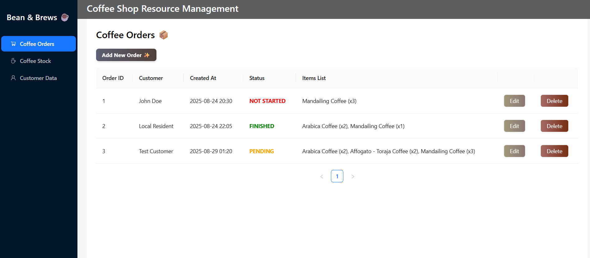
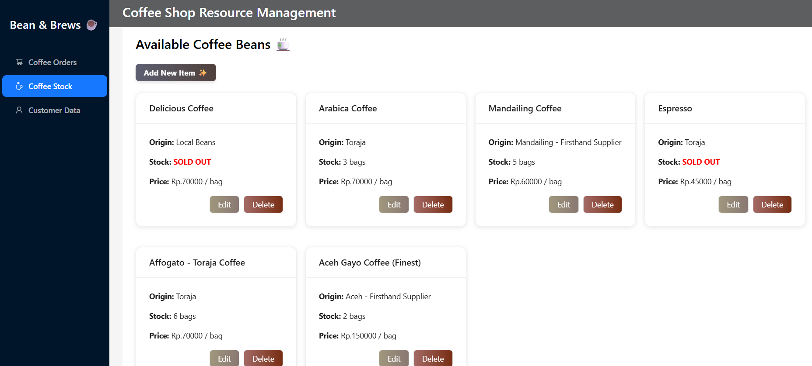
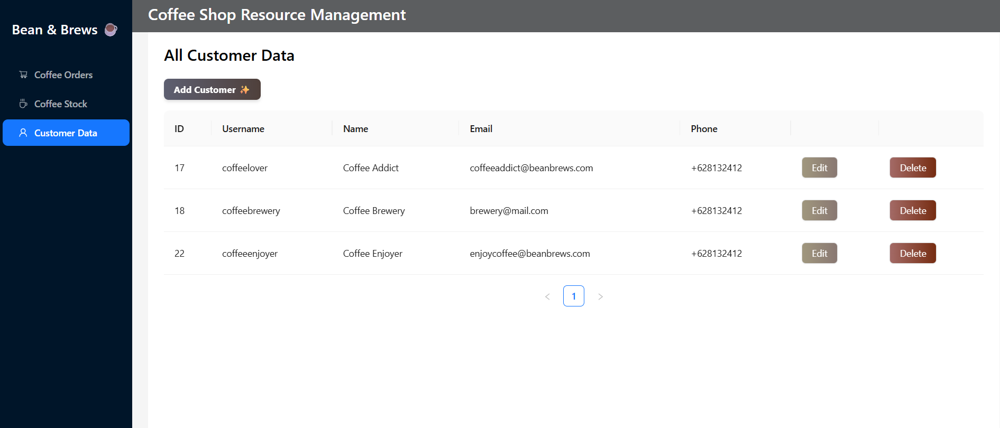

# Mini Coffee Shop Management
> A simple coffee shop management website for small coffee shop by React (AntD), FastAPI, and SQLite3

## Installing Dependencies
- Install SQLite3 for database
- Install all npm packages by running "npm install" on root of frontend directory

#### Extra Notes
- React ver: 19.1.1
- React-dom ver: 19.1.1
- AntD ver: 5.27.1

## Running the Website
1. Run frontend and backend in parallel.
2. Run venv first:
   - Switch to backend directory
   - Go to terminal and run: "venv\Scripts\activate"
   - **(If first time running)** In terminal you must run: pip install -r requirements.txt
4. To run frontend:
   - Switch to frontend directory,
   - Go to terminal and run: "npm run dev"
5. To run backend:
   - Switch to backend directory
   - Go to terminal and run: "uvicorn main:app --reload"
6. To run SQLite3 and check table state:
   - Switch to backend directory
   - Go to terminal and run "sqlite3 database.db"
   - Give SQL instructions as usual. If you want to check tables use ".tables

## Screenshots
### 1. Coffee Orders

### 2. Coffee Stock

### 3. Customer Data

   
